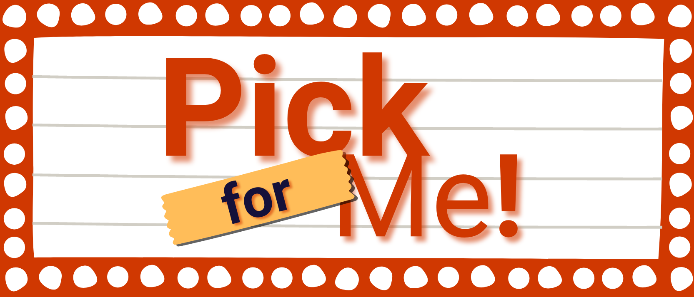

<h1 align="center">🚧 PickMe App 🚧</h1>

Refers to the 'Special Topics' (C317) subject from <a href='https://inatel.br/'>Inatel</a> in which students must develop a software product based on the <a href='https://www.servicenow.com/products/devops/what-is-sdlc.html'>'Software development life cycle' (SDLC)</a>.

You can run the application by clicking <b><u><a href='https://pickme-vert.vercel.app/'>here</a></u></b>.

<h1> Summary 📋</h1>

- <a href="#intro">Introduction</a>
- <a href="#technology">Technologies</a>
- <a href='#app'>Application Overview</a>
- <a href='#dev'>Development</a>
  - <a href='#front'>Front-end</a>
  - <a href='#back'>Back-end</a>
  - <a href='#tests'>Tests</a>
- <a href='#howto'>How to use</a>
- <a href='#future'>Thinking Forward</a>
- <a href="#concl">Conclusion</a>

<h2 id="intro" align="left">Introduction 📌</h2>
The <u><b>PickMe</b></u> is an application to indicate a movie or TV show based on your preferences such as favorite genre, the time you can spend watching, etc. It was designed to be simple and user-friendly, once it will be your best friend in that time you want to watch something and chill but have no ideia on what to put on your screen.

<h2 id="app" align="left">Application Overview 🔍</h2>

Here are some features of PickMe:

- Enter your preferences to receive a more accurate indication;
- Generate a totally random indication by clicking in one button;
- Save/delete the recommendation to/from your collection;
- Filters (on the collection page): by name, genre, release year, etc;
- Responsiveness.

<h2 id="dev" align="left">Development ⚙️</h2>

- <h3 id="front" align="left">Front-end 💻</h3>

  - <a id='TS'><b><u>TypeScript</u></b>: allows type verification;</a>
  - <a id='react'><b><u>React</u></b>: hooks and components;</a>
  - <a id='next'><b><u>NextJs</u></b>: routes optimization and serverside rendering;</a>
  - <a id='tailwind'><b><u>TailwindCSS</u></b>: styling classes;</a>
  - <b><u>Axios</u></b>: requests optimization;

  With these we could built an application which is <b>responsive</b>, <b>simple</b>, <b>clean</b> and <b>efficient</b>;

- <h3 id="back" align="left">Back-end 🧮</h3>

  - <a>Python</a>
  - <a id='aws'>AWS Lambda</a>
  - <a>API</a>

- <h3 id='tests' align='left'>Tests 🧪</h3>

  - <a id='jest'><b><u>Jest</u></b></a>: unit testing. please refer to the frontend <a href='https://github.com/jvoliveirag/C317/blob/main/frontend/README.md#tests'>docs</a> to see it runs.
  - <a id='cypress'><b><u>Cypress</u></b></a>: used to test the interface of the app. please refer to the frontend <a href='https://github.com/jvoliveirag/C317/blob/main/frontend/README.md#tests'>docs</a> to see it runs.
  - <a id='postman'><b><u>Postman</u></b></a>: used to test the API created in the backend. If you would like to try it you can click <a href=''>here</a> to go directly to the postman page, or you can download the .JSON file <a href='https://github.com/jvoliveirag/C317/blob/main/docs/postman/PickMe.postman_collection.json'>here</a> to run by yourself.

<h2 id='howto' align='left'>How to use 👨‍💻</h2>

<b><u>Obs.:</u></b> Both on your localhost and the production version it will run the same.

The images below describe how to generate a personalized and a totally random indication using PickMe.

<h2 id="future" align="left">Thinking Forward 💡</h2>
Since this is a POC built for a college subject certain things were prioritized over other (there were specific milestones with activities which should be developed and released every 2 weeks during the semester, just like in an actual company), so there are stuff I would like to keep developing and improving as well. Here are a few of them:
    
 - Complete user CRUD;
 - Show teaser of the recommendation;
 - Like/dislike an indication (feedback for the next indications);
 - Usage of AIs to improve the indication based on the user's preferences.

<h2 id="concl" align="left">Conclusion ✅</h2>
The <u><b>PickMe</b></u> is a simple but powerful tool to save you time when you just want to rest an chill watching something.

The technologies employed allow the app to have great performance on the most variable devices, as well as open up space to develop new features. <u><b>PickMe</b></u> ensures you won´t waste time choosing what you will watch, so you an definetly chill while you watch something you actualy enjoy.

<h2 id="credits" align="left">Credits 🎖️</h2>

Special thanks to the professors Renzo and Christopher for all the support during the development.

I also would like to thank my coleagues Ana Clara Santos, Mariana Bassi and Raphael Freitas, who helped me a lot on the kickoff of this project.

